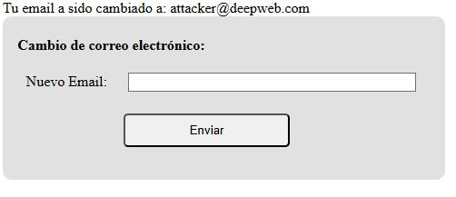
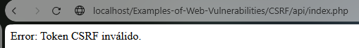

# Example of CSRF Vulnerability

A CSRF vulnerability allows an attacker to make requests to a website on your behalf using your session cookie.

### Vulnerable Website

http://localhost:8080/CSRF/api/UnsafeIndex.php

```
<?php
ini_set('display_errors', 1);
error_reporting(E_ALL);
if ($_SERVER['REQUEST_METHOD'] === "POST") {
        $email = filter_input(INPUT_POST, 'email', FILTER_SANITIZE_STRING);

        $email = htmlspecialchars($email, ENT_QUOTES, 'UTF-8');

        if (filter_var($email, FILTER_VALIDATE_EMAIL)) {
                echo "Tu email a sido cambiado a: " . $email;
        } else {
                echo "El Email insertado no es valido";
        }
}
?>
```

```
<form method="post">
    <label for="email">Nuevo Email:</label>
    <input type="text" size="40" name="email">
    <br>
    <button type="submit">Enviar</button>
</form>
```

For this example, we have a website that simulates changing an account's email address:


However, this website does not verify if the request is being sent from this form, so a fake website mimicking this one can be created. If you send any email from that fake site, the attacker's email will be sent instead.

http://localhost:8080/CSRF/UnsafeFakeForm.html

```
<form method="post" action="./api/index.php">
    <label for="notemail">Nuevo Email:</label> 
        <!-- Fake input for the user email -->
        <input type="text" size="40" name="notemail">
        <!-- Hidden input with the attacker Email -->
        <input type="hidden" value="attacker@deepweb.com" name="email">
        <br>
    <button type="submit">Enviar</button>
</form>
```

In reality, the email sent was: attacker@deepweb.com



### Secure Website

http://localhost:8080/CSRF/api/index.php

To prevent any website from making requests on your behalf, we generate a CSRF token that validates that the request was made from this website.

```
<?php
/* Session Token creation*/
session_start();
if (!isset($_SESSION['csrf_token'])) {
        $_SESSION['csrf_token'] = bin2hex(random_bytes(32));
}
/* Processing POST Request*/
if ($_SERVER['REQUEST_METHOD'] === "POST") {
        /* Check the session token if the token exists and is different to the actual token*/
        if (!isset($_POST['csrf_token']) || $_POST['csrf_token'] !== $_SESSION['csrf_token']) {
                die("Error: Token CSRF inválido.");
        }
        /* Validate Email Input */
        $email = filter_input(INPUT_POST, 'email', FILTER_SANITIZE_STRING);

        /* Deletes the special HTML Characteres*/
        $email = htmlspecialchars($email, ENT_QUOTES, 'UTF-8');

        /* If the Email is valid shows a text with th new E-Mail.*/
        if (filter_var($email, FILTER_VALIDATE_EMAIL)) {
                echo "Tu email a sido cambiado a: " . $email;
        } else {
                echo "El Email insertado no es valido";
        }
}
?>
```

And we include this token in the form.

```
<form method="post">
    <label for="email">Nuevo Email:</label>
    <input type="text" size="40" name="email">
    <input type="hidden" name="csrf_token" value="<?php echo $_SESSION['csrf_token']; ?>"> <!--Input with the CSRF Token -->
    <br>
    <button type="submit">Enviar</button>
</form>
```

If we use this form to make a request to the protected website, an error will be raised because we don't have a valid token.

http://localhost:8080/CSRF/FakeForm.html


