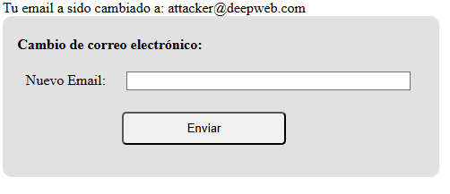
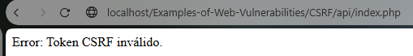

# Ejemplo de la vulnerabilidad CSRF

Una vulnerabilidad CSRF es una vulnerabilidad que permite a un atacante realizar peticiones a un sitio web en tu nombre usando tu cookie de inicio de sesión.
### Sitio web vulnerable

http://localhost/Examples-of-Web-Vulnerabilities/CSRF/api/UnsafeIndex.php

```
<?php
ini_set('display_errors', 1);
error_reporting(E_ALL);
if ($_SERVER['REQUEST_METHOD'] === "POST") {
        $email = filter_input(INPUT_POST, 'email', FILTER_SANITIZE_STRING);

        $email = htmlspecialchars($email, ENT_QUOTES, 'UTF-8');

        if (filter_var($email, FILTER_VALIDATE_EMAIL)) {
                echo "Tu email a sido cambiado a: " . $email;
        } else {
                echo "El Email insertado no es valido";
        }
}
?>
```

```
<form method="post">
    <label for="email">Nuevo Email:</label>
    <input type="text" size="40" name="email">
    <br>
    <button type="submit">Enviar</button>
</form>
```

Para este ejemplo tenemos un sitio web que simula cambiar el correo electronico de una cuenta:


No obstante este sitio web no verifica si la petición esta siendo enviada desde este formulario, por lo que se puede crear un sitio web falso que simule ser esta web, si envias cualquier correo desde esta web en su lugar se enviara el correo de un atacante.

http://localhost/Examples-of-Web-Vulnerabilities/CSRF/UnsafeFakeForm.html

```
<form method="post" action="./api/index.php">
    <label for="notemail">Nuevo Email:</label> 
        <!-- Fake input for the user email -->
        <input type="text" size="40" name="notemail">
        <!-- Hidden input with the attacker Email -->
        <input type="hidden" value="attacker@deepweb.com" name="email">
        <br>
    <button type="submit">Enviar</button>
</form>
```

En realidad se ha enviado el correo: attacker@deepweb.com



### Secure Website

http://localhost/Examples-of-Web-Vulnerabilities/CSRF/api/index.php

Para prevenir que cualquier sitio web pueda hacer peticiones a tu nombre generamos un token CSRF que valida que la petición se ha hecho desde este sitio web.

```
<?php
/* Session Token creation*/
session_start();
if (!isset($_SESSION['csrf_token'])) {
        $_SESSION['csrf_token'] = bin2hex(random_bytes(32));
}
/* Processing POST Request*/
if ($_SERVER['REQUEST_METHOD'] === "POST") {
        /* Check the session token if the token exists and is different to the actual token*/
        if (!isset($_POST['csrf_token']) || $_POST['csrf_token'] !== $_SESSION['csrf_token']) {
                die("Error: Token CSRF inválido.");
        }
        /* Validate Email Input */
        $email = filter_input(INPUT_POST, 'email', FILTER_SANITIZE_STRING);

        /* Deletes the special HTML Characteres*/
        $email = htmlspecialchars($email, ENT_QUOTES, 'UTF-8');

        /* If the Email is valid shows a text with th new E-Mail.*/
        if (filter_var($email, FILTER_VALIDATE_EMAIL)) {
                echo "Tu email a sido cambiado a: " . $email;
        } else {
                echo "El Email insertado no es valido";
        }
}
?>
```

Y enviamos este token en el formulario.

```
<form method="post">
    <label for="email">Nuevo Email:</label>
    <input type="text" size="40" name="email">
    <input type="hidden" name="csrf_token" value="<?php echo $_SESSION['csrf_token']; ?>"> <!--Input with the CSRF Token -->
    <br>
    <button type="submit">Enviar</button>
</form>
```

Si usamos este formulario para hacer una petición al sitio web securizado saltara un error porque no tenemos un token valido.

http://localhost/Examples-of-Web-Vulnerabilities/CSRF/FakeForm.html




