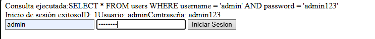
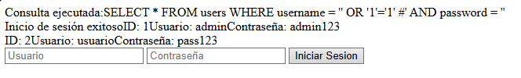
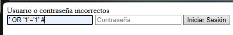

# SQL Injection Vulnerability Example

This vulnerability consists of attempting to extract information from the database using SQL query syntax manipulation.

> **Note:** If you are using **Docker**, the `seguridad_db` database and its tables are initialized automatically when running `docker compose up -d`.

If you do not have the sample database and are running manually:

### Start Database
Start MySQL:
```bash
sudo systemctl start mysql
```

Log into MySQL:
```bash
sudo mysql -u root -p
```

Create the sample database:
```sql
CREATE DATABASE seguridad_db;
USE seguridad_db;

CREATE TABLE users (
    id INT AUTO_INCREMENT PRIMARY KEY,
    username VARCHAR(50) NOT NULL,
    password VARCHAR(100) NOT NULL
);

INSERT INTO users (username, password) VALUES ('admin', 'admin123'), ('usuario', 'pass123');
SET PASSWORD FOR 'root'@'localhost' = PASSWORD('root');
EXIT;
```

### Vulnerable Code

http://localhost:8080/SQL_INJECTION/login.php

This web page contains a form simulating a user login:

```html
<form method="post">
    <input type="text" name="username" placeholder="Usuario">
    <input type="password" name="password" placeholder="Contraseña">
    <button type="submit">Iniciar Sesion</button>
</form>
```

And this is the PHP code processing the request:

```php
$query = "SELECT * FROM users WHERE username = '$username' AND password = '$password'";
echo "Consulta ejecutada:" . $query . "<br>";

$result = $conn->query($query);

if ($result) {
    if ($result->num_rows > 0) {
        echo "Inicio de sesión exitoso";
        while ($row = $result->fetch_assoc()) {
            echo "ID: " . $row['id'] . " Usuario: " . $row['username'] . " Contraseña: " . $row['password'] . "<br>";
        }
    } else {
        echo "Usuario o contraseña incorrecta";
    }
} else {
    echo "Error en la consulta: " . $conn->error;
}
```



If we send an SQL expression that always evaluates to true, we will retrieve the entire list of users from the database:

```sql
' OR '1'='1' #
```



### Secure Code

http://localhost:8080/SQL_INJECTION/login_securized.php

```php
/* Get the statements from the posts*/
$username = trim($_POST["username"]);
$password = trim($_POST["password"]);

/* Create the SQL Query*/
$stmt = $conn->prepare("SELECT id, username, password FROM users WHERE username = ? AND password = ?");
$stmt->bind_param("ss", $username, $password);
$stmt->execute();
```

By changing the SQL query to use prepared statements, parameters are safely handled without the risk of SQL injection attacks.



