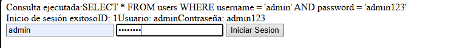
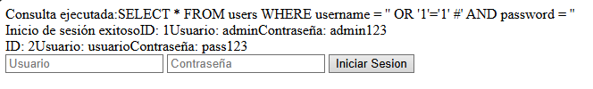

# SQL INJECTION Example

This vulnerability consists of get information of the server database using the syntax of the SQL Query.

If you not have the example database create it:

### Start Database
Start MySQL
```
sudo systemctl start mysql
```

Login into MySQL
```
sudo mysql -u root -p
```

Create the database
```
CREATE DATABASE seguridad_db;

USE seguridad_db;

CREATE TABLE users (
id INT AUTO_INCREMENT PRIMARY KEY,
username VARCHAR(50) NOT NULL,
password VARCHAR(100) NOT NULL
);

INSERT INTO users (username, password) VALUES ('admin', 'admin123'), ('usuario', 'pass123');
SET PASSWORD FOR 'root'@'localhost' = PASSWORD('root');

EXIT;
```

### Vulnerable code

http://localhost/Examples-of-Web-Vulnerabilities/SQL_INJECTION/login.php

This example contains a form used to login in this page:

```
<form method="post">
    <input type="text" name="username" placeholder="Usuario">
    <input type="password" name="password" placeholder="Contraseña">
    <button type="submit">Iniciar Sesion</button>
</form>
```

The PHP code process the requests and shows the result:

```
    $query = "SELECT * FROM users WHERE username = '$username' AND password = '$password'";
    echo = "Consulta ejecutada:" . $query . "<br>";

    $result = $conn->query($query)

    if ($result) {
        if ($result->num_rows > 0) {
            echo "Inicio de sesión exitoso";

            while ($row = $result->fetch_assoc()) {
                echo "ID: " $row['id'] . "Usuario: " . $row['username'] . "Contraseña: " . row['password'] . "<br>";
            }
        } else {
            echo "Usuario o contraseña incorrecta";
        }
    } else {
        echo "Error en la consulta: " . $conn->error;
    }
```



 But if you send a condition with is true you should get the full table of the database.

 ```
 ' OR '1'='1' #
 ```
 
 

### Secure code

http://localhost/Examples-of-Web-Vulnerabilities/SQL_INJECTION/login_securized.php

```
/* Get the statements from the posts*/
    $username = trim($_POST["username"]);
    $password = trim($_POST["password"]);

    /* Crate de SQL Query*/
    $stmt = $conn->prepare("SELECT id, username, password FROM users WHERE username = ? AND password = ?");
    $stmt->bind_param("ss", $username, $password);
    $stmt->execute();
```

This changes the query statment to insert 2 strings as params and executes the query.


