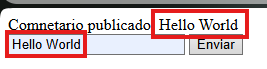
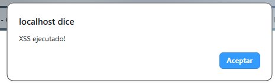
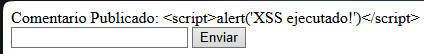

# Example of XSS Vulnerability

An XSS vulnerability consists of sending malicious code through an input form.

### Vulnerable Code

http://localhost:8080/XSS/comment.php

This website displays the HTML code submitted in the form.

```
<?php
ini_set('display_errors', 1);
error_reporting(E_ALL);
if (isset ($_POST['comment'])) {
    echo "Comnetario publicado: " . $_POST['comment'];
}
?>
<form method="post">
    <input type="text" name="comment">
    <button type="submit">Enviar</button>
</form>
```

Submitting plain text renders normally:



However, inserting HTML/script tags causes the application to execute them:

```
<script>alert('XSS ejecutado!')</script>
```



### Secure Code

http://localhost:8080/XSS/comment_securized.php

To prevent attackers from injecting HTML code into your website, HTML special characters must be encoded to treat input strictly as plain text.

```
<?php
ini_set('display_errors', 1);
error_reporting(E_ALL);

if (isset ($_POST['comment'])) {
    $comment = htmlspecialchars($_POST['comment'], ENT_QUOTES, 'UTF-8'); // Convert the HTML Special Characters

    if (!empty($comment) && strlen($comment) <= 500) {
        echo("Comentario Publicado: " . $comment);
    } else {
        echo("Error por limite de caracteres, el comentario tiene un limite de 500 caracteres.");
    }
}
?>
<form method="post">
    <input type="text" name="comment">
    <button type="submit">Enviar</button>
</form>
```

Submitting the script payload again causes the browser to safely display it as plain text.

