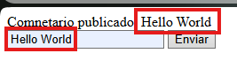
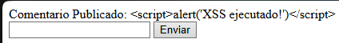

# XSS Exploit Example

an XSS Vulnerability consist in sent malicuis code to a Website with the aim of infect the server or the user of a website.

### Vulnerable code

http://localhost/Examples-of-Web-Vulnerabilities/XSS/comment.php

This website contains a HTML Form what shows the text that you sent with a POST Request.

```
<?php
ini_set('display_errors', 1);
error_reporting(E_ALL);
if (isset ($_POST['comment'])) {
    echo "Comnetario publicado: " . $_POST['comment'];
}
?>
<form method="post">
    <input type="text" name="comment">
    <button type="submit">Enviar</button>
</form>
```

If you send a simple text the website shows it.



But if you insert HTML code in this form the browser executes it

```
<script>alert('XSS ejecutado!')</script>
```


### Secure code

http://localhost/Examples-of-Web-Vulnerabilities/XSS/comment_securized.php

If you want to prevent that a malicius attack inject code in your website you can convert the special html character and the browser will no execute the HTML Code

```
<?php
ini_set('display_errors', 1);
error_reporting(E_ALL);

if (isset ($_POST['comment'])) {
    $comment = htmlspecialchars($_POST['comment'], ENT_QUOTES, 'UTF-8'); // Convert the HTML Special Characters

    if (!empty($comment) && strlen($comment) <= 500) {
        echo("Comentario Publicado: " . $comment);
    } else {
        echo("Error por limite de caracteres, el comentario tiene un limite de 500 caracteres.");
    }
}
?>
<form method="post">
    <input type="text" name="comment">
    <button type="submit">Enviar</button>
</form>
```

If you send HTML Code in this form the bowser interprets it as plain text and don't execute the alert.

