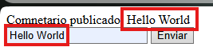
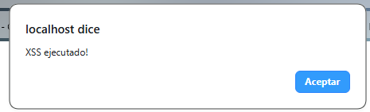
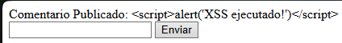

# Ejemplo de una vulnerabilidad XSS

Una vulnerabilidad XSS consiste en enviar codigo malicioso a traves de un formulario.

### Vulnerable code

http://localhost/Examples-of-Web-Vulnerabilities/XSS/comment.php

Este sitio web muestra el codigo HTML que se le pasa en el formulario.

```
<?php
ini_set('display_errors', 1);
error_reporting(E_ALL);
if (isset ($_POST['comment'])) {
    echo "Comnetario publicado: " . $_POST['comment'];
}
?>
<form method="post">
    <input type="text" name="comment">
    <button type="submit">Enviar</button>
</form>
```

Si enviamos solo texto lo muestra asi.



Pero si insertas codigo HTML en la web esta lo ejecutara.

```
<script>alert('XSS ejecutado!')</script>
```



### Codigo seguro

http://localhost/Examples-of-Web-Vulnerabilities/XSS/comment_securized.php

Si quieres prevenir que un atacante inyecte codigo HTML a tu sitio web debes filtrar los caracteres especiales HTML para ejecutarlos como texto plano.

```
<?php
ini_set('display_errors', 1);
error_reporting(E_ALL);

if (isset ($_POST['comment'])) {
    $comment = htmlspecialchars($_POST['comment'], ENT_QUOTES, 'UTF-8'); // Convert the HTML Special Characters

    if (!empty($comment) && strlen($comment) <= 500) {
        echo("Comentario Publicado: " . $comment);
    } else {
        echo("Error por limite de caracteres, el comentario tiene un limite de 500 caracteres.");
    }
}
?>
<form method="post">
    <input type="text" name="comment">
    <button type="submit">Enviar</button>
</form>
```

Si vuelves a enviar ese script el navegador lo ejecutara como texto plano.

