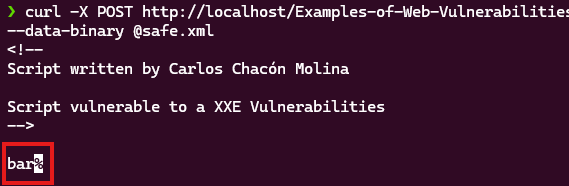
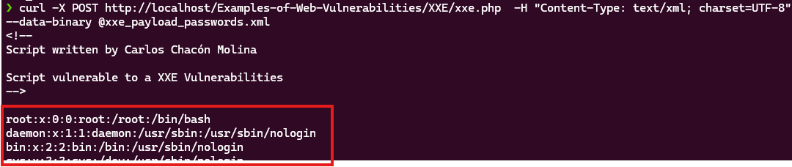
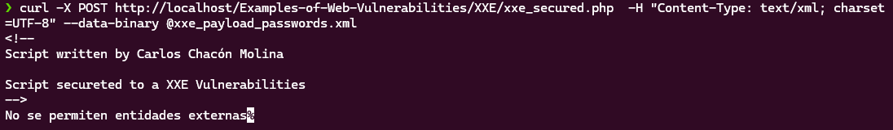

# XXE Vulnerablity Example
A XXE Vulnerabiliy allows the attacker to execute remote code usando the System Entities of a XML Document

### A XML Entity

A XML Entity is similar to a variable in a programming lenguages allowing to the document to safe and load information in variables, the System Entities read data from the system.

```
<!DOCTYPE foo [
<!ENTITY xxe SYSTEM "file:///etc/passwd"> // Read the content of /etc/passwd
]>
<foo>&xxe;</foo>
```

### Vulnerable Code

http://localhost/Examples-of-Web-Vulnerabilities/XXE/xxe.php

This code shows the content of the XML Document in the post request

```
<?php
/* Display PHP Errors */
ini_set('display_errors', 1);
error_reporting(E_ALL);

/* Create a DOM Document */
$dom = new DOMDocument();

/* Get the XML loaded in the POST Requests */
$dom->loadXML(file_get_contents('php://input'), LIBXML_NOENT | LIBXML_DTDLOAD);

/* Convert the XML document into a SimpleXMLDocument*/
$parsed = simplexml_import_dom($dom);

/* Shows the result */
echo $parsed;
?>
```

To send a file to the website you can use the curl command

```
curl -X POST http://localhost/Examples-of-Web-Vulnerabilities/XXE/xxe.php  -H "Content-Type: text/xml; charset=UTF-8" --data-binary @safe.xml
```



If you send a XML with System Entities you can get the system files.

```
curl -X POST http://localhost/Examples-of-Web-Vulnerabilities/XXE/xxe.php  -H "Content-Type: text/xml; charset=UTF-8" --data-binary @xxe_payload_passwords.xml
```


### Secure Code

To elimite this vulnerability you must stop the execution if the XML contains a Entity

```
/* If the XML Document contains entities finish the execution */
if (strpos(file_get_contents('php://input'), "<!ENTITY") !== false){
    die("No se permiten entidades externas");
}
```

Send the Passwd payload

```
curl -X POST http://localhost/Examples-of-Web-Vulnerabilities/XXE/xxe_secured.php  -H "Content-Type: text/xml; charset=UTF-8" --data-binary @xxe_payload_passwords.xml
```



